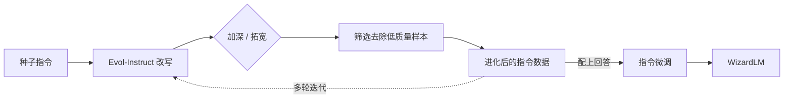

> 本文是对经典工作的阅读笔记。出处：Xu et al., 2023, "WizardLM: Empowering Large Language Models to Follow Complex Instructions", arXiv:2304.12244（https://arxiv.org/abs/2304.12244）。本文仅在论文公开陈述的范围内做梳理与归纳。

## TL;DR

- 人工编写的指令往往偏简单、分布单一，难以训练出能处理复杂任务的模型。
- Evol-Instruct 让 LLM 自动「进化」指令：通过加深难度、增加约束、拓展广度等改写操作，把简单指令演化成更复杂、更多样的指令数据。
- 用这些进化得到的数据进行指令微调，得到 WizardLM，其复杂指令遵循能力更强。
- 它是「数据合成 / 指令进化」这一思路在对齐研究中的代表性工作之一。

## 一、问题：指令数据的「复杂度天花板」

指令微调（instruction tuning）的效果高度依赖训练指令的质量与覆盖面。早期常见做法是由人工撰写或采集指令，但人工产出的指令存在两个结构性局限：一是难度普遍偏低，多数集中在简单问答、短改写等任务上；二是分布单一，约束条件少、推理步骤浅。模型在这样的数据上训练，自然倾向于擅长简单请求，而在面对包含多重约束、长链条推理或需要多步执行的复杂指令时表现不足。

要系统性地提升复杂指令遵循能力，关键在于获得「足够复杂且足够多样」的指令数据。但靠人力持续产出高复杂度指令既昂贵又难以规模化——这正是 Evol-Instruct 试图回答的问题。

## 二、核心思想：用 LLM 让指令自我「进化」

Evol-Instruct 的基本设定是：不再依赖人工把指令写难，而是借助一个 LLM，对已有的简单指令施加一系列「改写算子」，使其逐步演化为更复杂的版本。这一过程从一批种子指令出发，反复迭代，逐轮提升数据的难度与多样性。

论文将进化操作大致归为两类思路：

- 加深（in-depth）：在原指令基础上提高难度与复杂度，例如增加约束条件、要求更深的推理、引入更具体的限定，使任务从「能答」走向「答得严谨」。
- 拓宽（in-breadth）：围绕原指令生成主题或形式上全新的指令，扩大指令在任务空间中的覆盖面，提升多样性。

下表对两类操作的目标做概括性对比：

| 维度 | 加深（in-depth） | 拓宽（in-breadth） |
| --- | --- | --- |
| 主要目标 | 提升单条指令的难度 | 扩大指令的覆盖范围 |
| 典型手段 | 增加约束、加深推理、细化要求 | 生成主题/形式上不同的新指令 |
| 作用方向 | 让任务更「难」 | 让任务更「杂」 |

在每一轮进化后，还需要对生成结果做筛选，剔除无效、退化或与原意明显偏离的指令，避免低质量样本污染数据集。经过多轮迭代，原本简单的种子指令被演化成一个难度分层、覆盖更广的指令集合。

## 三、从进化数据到 WizardLM

得到进化后的指令数据后，流程回到标准的指令微调范式：为这些指令配上相应回答，构成指令—响应对，再对基础语言模型进行监督微调，所得模型即 WizardLM。论文报告，相较使用较简单指令数据训练的模型，WizardLM 在复杂指令遵循上表现出更强的能力。

整个方法的链路可概括如下：

这一闭环的价值在于：复杂度不再由人工一次性给定，而是通过 LLM 的迭代改写逐步累积，使得数据生产具备可扩展性。

## 四、定位：数据合成在对齐中的角色

WizardLM 所代表的，是对齐研究中「数据为中心」的一条路线。与改进训练目标或优化算法不同，Evol-Instruct 把注意力放在「训练数据如何被构造」上：用模型自身的能力去生产更高质量的训练信号，再反哺模型。这种思路与同期一系列利用 LLM 自动生成或扩展指令数据的工作共同构成了「指令进化 / 数据合成」的研究脉络，也为后续在更复杂任务上构造训练数据提供了可借鉴的范式。

## 意义与局限

意义层面，Evol-Instruct 提供了一种可规模化提升指令复杂度与多样性的方法，把「让指令更难更杂」从人工劳动转化为可迭代的自动流程，并通过 WizardLM 验证了进化数据对复杂指令遵循能力的正向作用。

局限层面，方法的效果依赖用于进化的 LLM 自身的能力上限：进化指令的质量、难度合理性以及配套回答的正确性，都会受到生成模型能力的约束；多轮进化也可能带来指令退化、约束堆叠不自然或语义漂移等问题，因而筛选环节不可或缺。此外，「更复杂」并不必然等同于「更有用」，进化数据与真实使用场景之间的分布匹配仍需结合具体任务审慎评估。

> 延伸阅读：Xu et al., 2023, "WizardLM: Empowering Large Language Models to Follow Complex Instructions", arXiv:2304.12244（https://arxiv.org/abs/2304.12244）。
