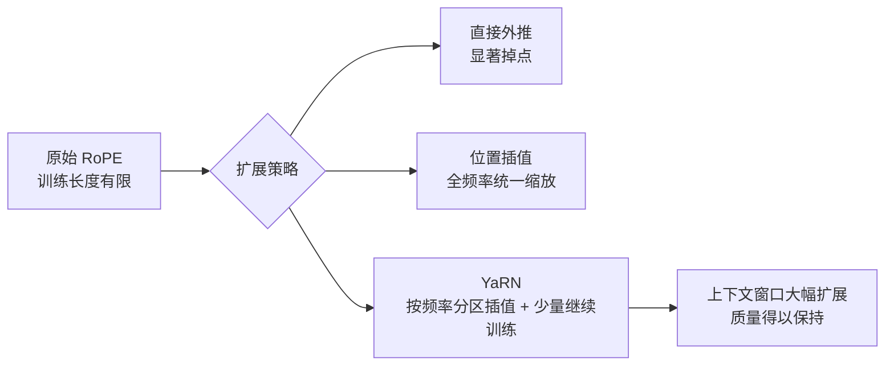

> 本文是对经典工作的阅读笔记，对象为 Peng et al., 2023 的《YaRN: Efficient Context Window Extension of Large Language Models》（arXiv:2309.00071，[https://arxiv.org/abs/2309.00071](https://arxiv.org/abs/2309.00071)）。下文围绕该论文公开陈述的问题、方法与定位展开梳理，不引入原文之外的具体数值结论。

## TL;DR

- 使用 RoPE 位置编码的模型，训练时的上下文长度是有限的；直接外推到更长的序列会显著掉点。
- YaRN 改进了对 RoPE 频率的插值方式（融合 NTK 感知等思路），用很少的继续训练就能把上下文窗口大幅扩展。
- 相比此前的位置插值方法，YaRN 在达到同等扩展效果时更为高效。
- 它已成为大模型长上下文扩展中常被采用的技术路线之一。

## 一、背景：RoPE 与长度外推的矛盾

旋转位置编码（RoPE）通过对查询与键向量按位置施加旋转，把相对位置信息隐式编码进注意力计算中。它在训练阶段表现良好，但有一个内在约束：模型只在某个有限的上下文长度上被训练过，对应的位置旋转角度也只覆盖了这一范围内的取值分布。

当推理时把序列拉到远超训练长度，RoPE 需要表示训练中从未出现过的位置关系，相当于要求模型对未见过的旋转相位做外推。结果是注意力分布失真，输出质量明显下降。这正是长上下文扩展要解决的核心矛盾：既想要更长的窗口，又不愿付出从头重训的代价。

## 二、核心思想：从位置插值到频率插值

一种朴素的思路是位置插值（Position Interpolation）：把更长序列的位置坐标线性压缩，映射回训练时见过的范围内，使旋转角度仍落在熟悉的区间。这种做法能缓解外推失真，但它对 RoPE 的所有频率分量一视同仁地缩放，未必是最优选择。

YaRN 的出发点在于：RoPE 的不同频率维度承载着不同尺度的位置信息。高频维度刻画的是相邻 token 间的精细相对关系，低频维度刻画的是跨越较远距离的整体关系。若对所有维度施加相同的插值，会损害对局部关系的分辨能力。基于 NTK 感知（NTK-aware）的视角，应当对不同频率区别对待——对高频少压缩、对低频多调整，从而在扩展长程范围的同时尽量保留近程的精细信息。

YaRN 在这一思路上做了系统化整合，使得改写后的频率插值方案既能覆盖更长的位置范围，又维持原有的注意力行为质量。

## 三、方法拆解

可以把 YaRN 的关键点分几层来理解：

- 频率分区处理：区分高频与低频维度，按维度承载的信息尺度采取不同的插值强度，而非对全部维度统一缩放。
- NTK 感知思路：借助对旋转频率分布的分析，使扩展后的相位仍尽量贴合模型在训练阶段所适应的模式。
- 少量继续训练：YaRN 不要求大规模重训，只需在少量数据上做继续训练，即可让模型适配扩展后的位置表示。
- 高效性定位：在达到同等扩展目标时，所需的训练步数与数据规模相对更少，这是它相较此前方法的主要优势。

下面用一张表对比几种典型做法的取向（定性描述，不涉及具体指标数值）：

| 方法 | 处理 RoPE 的方式 | 是否需要继续训练 | 长度外推时的质量倾向 |
| --- | --- | --- | --- |
| 直接外推 | 不做任何调整 | 否 | 明显下降 |
| 位置插值 | 全频率统一压缩 | 通常需要少量 | 有所改善 |
| YaRN | 按频率分区插值（NTK 感知等） | 仅需很少 | 在大幅扩展下保持质量 |

## 四、为何"高效"是关键卖点

长上下文能力的价值毋庸赘述，但落地时真正稀缺的是成本。从头训练一个原生长窗口模型代价高昂；即便只是扩展窗口，若仍需大量继续训练，也会让多数团队望而却步。

YaRN 的意义恰在于把"扩展窗口"这件事的边际成本压低：在已有模型的基础上，用很少的继续训练把窗口拉长，同时不显著牺牲原有质量。这种"低成本改造"的属性，使它容易被纳入现有模型的迭代流程，也因此成为长上下文扩展中常被采用的技术路线之一。

## 意义与局限

YaRN 把对 RoPE 频率的精细插值与少量继续训练结合起来，为长上下文扩展提供了一条性价比较高的路径。它体现了一个普遍经验：当位置编码具有清晰的频率结构时，针对该结构定制的调整往往优于"一刀切"的均匀变换。

需要客观看待的是，YaRN 是一种针对 RoPE 一族位置编码的扩展技术，其适用范围与该类编码绑定；扩展后的长度区间、所需继续训练的规模，仍取决于具体模型与任务设置。此外，窗口被拉长之后，能否在长程依赖上真正用好这些上下文，还涉及数据、注意力实现与下游任务等多重因素，并非单一扩展技术所能完全决定。即便如此，作为低成本扩展窗口的代表性方案，YaRN 在长上下文工程实践中具有持续的参考价值。

> 延伸阅读：YaRN: Efficient Context Window Extension of Large Language Models（arXiv:2309.00071，[https://arxiv.org/abs/2309.00071](https://arxiv.org/abs/2309.00071)）
