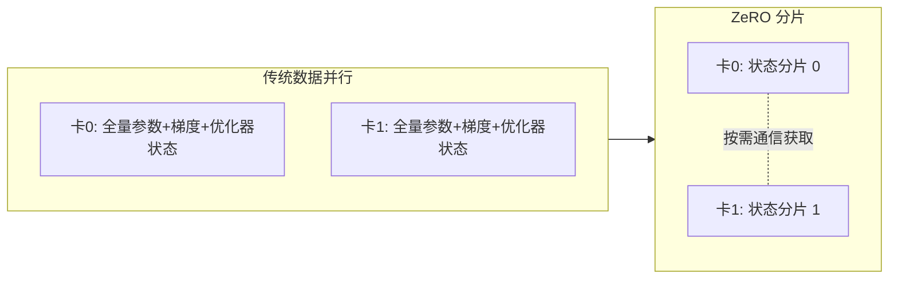

> 本文是对经典论文的阅读笔记。原文为 Rajbhandari et al.（Microsoft），2019，《ZeRO: Memory Optimizations Toward Training Trillion Parameter Models》，arXiv:1910.02054（https://arxiv.org/abs/1910.02054）。ZeRO 是 DeepSpeed 的核心技术之一，本文尝试梳理其动机、分片思路与适用边界。

## TL;DR

- 传统数据并行下，每张卡都各自保存一份完整的优化器状态、梯度与参数，显存冗余巨大。
- ZeRO 的核心思路是把这些状态「分片」到各数据并行 rank 上，需要时再通过通信获取，从而显著降低单卡显存占用。
- ZeRO 分为 ZeRO-1/2/3 等阶段，逐步对优化器状态、梯度、参数进行分片。
- 它让在有限显存条件下训练超大规模模型成为可能，是支撑 DeepSpeed 训练超大模型的关键机制。

## 一、背景与动机：数据并行的「重复账单」

数据并行（Data Parallelism）是分布式训练中最常用、最易实现的范式：模型在每张卡上各保留一份完整副本，不同卡处理不同的数据批次，反向传播后再同步梯度。它的吞吐扩展性很好，但有一个长期被忽视的代价——**显存冗余**。

在标准数据并行中，每一张卡都独立保存着同样的三类「训练状态」：模型参数、对应的梯度，以及优化器状态。其中优化器状态往往是显存占用的大头：以常见的自适应优化器为例，除了参数本身，还要维护动量、方差等额外的统计量，再叠加混合精度训练所需的高精度参数副本，单是这一部分就可能数倍于参数本身的体积。

问题在于：这些内容在每张卡上几乎是**逐字节重复**的。卡越多，重复的总量越大，但单卡能容纳的模型规模却丝毫没有变大。换句话说，朴素数据并行用「线性增加的总显存」换来了吞吐，却没有换来「更大的模型」。当目标是训练参数量极其庞大的模型时，这种冗余就成了硬性天花板。

## 二、核心思想：从「人手一份」到「分而存之」

ZeRO（Zero Redundancy Optimizer，零冗余优化器）给出的答案直截了当：既然每张卡都存着同样的东西是一种浪费，那就**不要让每张卡都存全量**。

具体做法是把训练状态在数据并行的各个 rank 之间进行**分片（partition）**：每张卡只负责保存其中的一部分，而不是完整副本。当某个 rank 在计算中确实需要它当前没有持有的那部分状态时，再通过卡间通信临时获取。这样一来，原本被无谓复制 N 份的状态，理论上被摊薄到了约 1/N，单卡显存占用随之大幅下降，腾出的空间就可以用来承载更大的模型或更长的序列。

这一思路最关键的洞见在于：它在保留数据并行计算模式的同时，消除了数据并行固有的存储冗余。模型并行通常需要侵入式地切分计算图，而 ZeRO 切分的是「状态的存储」，用通信换显存，对训练逻辑的改动相对克制。

## 三、分阶段的分片：ZeRO-1 / 2 / 3

ZeRO 并不是一次性把所有东西都切开，而是按对显存收益由大到小、对通信代价由小到大的顺序，**分阶段**地引入分片。三类训练状态被逐步纳入分片范围：

| 阶段 | 分片对象 | 直观效果 |
| --- | --- | --- |
| ZeRO-1 | 优化器状态 | 先切掉占比最大的一块，显存收益明显，通信代价相对温和 |
| ZeRO-2 | 优化器状态 + 梯度 | 在前者基础上进一步分片梯度，单卡占用继续下降 |
| ZeRO-3 | 优化器状态 + 梯度 + 参数 | 连参数本身也分片，单卡显存压力最小，通信也最重 |

这种递进式设计的实践意义在于：使用者可以根据自己的显存预算与互联带宽，在「省显存」和「通信开销」之间选择合适的折中点。显存吃紧、带宽充裕时可以走更激进的阶段；反之则停留在较轻量的阶段，避免通信成为瓶颈。三个阶段共享同一套「分片—按需聚合」的基本框架，区别只在于纳入分片的状态种类多少。

## 四、它带来了什么：让「更大」成为可能

ZeRO 的价值不只是节省了一些显存数字，而是改变了「单卡显存」与「可训练模型规模」之间的绑定关系。在朴素数据并行里，可训练的最大模型受限于单卡能否塞下一整份训练状态；而在 ZeRO 下，训练状态被摊到整个数据并行集群上，集群规模越大，可承载的模型也越大。这正是 DeepSpeed 能够支撑超大规模模型训练的关键机制之一。

同时，由于 ZeRO 保留了数据并行的外在形态，它与其他并行策略（如流水线并行、张量并行）并不天然冲突，可以组合使用，构成更完整的大模型训练方案。对工程实践而言，这意味着在不彻底重写训练代码的前提下，就能把现有数据并行训练扩展到更大的模型上。

## 意义与局限

ZeRO 的意义在于，它以一个朴素却有力的观察——「数据并行存在大量重复存储」——为切口，把消除冗余做成了一套可分阶段落地的工程方案，显著拓宽了在有限显存下可训练模型规模的边界，并成为 DeepSpeed 的核心能力之一。

局限同样需要正视。分片不是没有代价的：被切开的状态需要在计算时通过通信重新聚合，这意味着 ZeRO 用**额外的通信**换取了显存的节省，越激进的阶段对集群互联带宽越敏感，在带宽不足时可能引入明显开销。其收益也依赖于足够多的数据并行 rank——分片到的卡越多，单卡省下的越多，反之收益有限。因此，选择哪个阶段、是否与其他并行方式组合，本质上是一道随硬件条件和模型规模而变的权衡题，而非放之四海皆优的银弹。

> 延伸阅读：Rajbhandari et al., 《ZeRO: Memory Optimizations Toward Training Trillion Parameter Models》，arXiv:1910.02054（https://arxiv.org/abs/1910.02054）。
